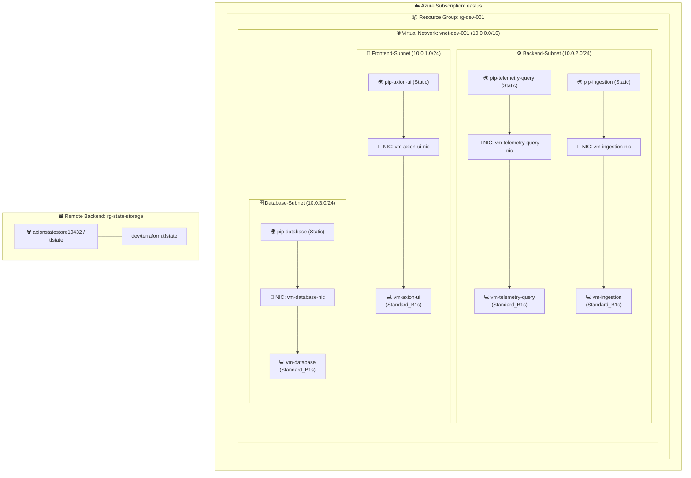

# 🚀 Azure Monolithic Application Infrastructure (Terraform) ☁️

[](https://www.terraform.io/)
[](https://registry.terraform.io/providers/hashicorp/azurerm/latest)
[](https://ubuntu.com/)
[](#)
[](#)

---

## 📌 Table of Contents

- [✨ Overview](#-overview)
- [🏛️ Architecture Overview](#️-architecture-overview)
- [🧩 Reusable Modules](#-reusable-modules)
- [📂 Project Directory Structure](#-project-directory-structure)
- [⚙️ Environment Configuration (`dev`)](#️-environment-configuration-dev)
  - [🌐 Network & Subnets](#-network--subnets)
  - [🖥️ Virtual Machines & Workloads](#️-virtual-machines--workloads)
  - [🌍 Public IPs](#-public-ips)
- [📋 Prerequisites](#-prerequisites)
- [🚀 Deployment Guide](#-deployment-guide)
  - [1. Authenticate with Azure](#1-authenticate-with-azure)
  - [2. Initialize Terraform Backend](#2-initialize-terraform-backend)
  - [3. Review Plan](#3-review-plan)
  - [4. Provision Infrastructure](#4-provision-infrastructure)
  - [5. Teardown / Destroy](#5-teardown--destroy)
- [🔐 Security Best Practices & Recommendations](#-security-best-practices--recommendations)
- [🤝 Contributing](#-contributing)
- [📄 License](#-license)

---

## ✨ Overview

This repository contains modular, production-ready **Infrastructure as Code (IaC)** using **Terraform** to provision a multi-tier **Monolithic / Multi-Service Application** stack on **Microsoft Azure**.

### 🌟 Key Highlights:
- 🧱 **100% Modular Architecture**: Dedicated, reusable modules for Resource Groups, Virtual Networks, Subnets, Public IPs, and Linux Virtual Machines.
- 🔁 **Data-Driven & Dynamic**: Powered by `for_each` and map data structures for zero-code scalability.
- 🌐 **Tiered Network Isolation**: Clean subnet segregation across **Frontend**, **Backend**, and **Database** layers.
- 💾 **Remote State Storage**: Configured with Azure Blob Storage backend for robust state locking and collaboration.
- 🐧 **Modern Linux OS**: Standardized on Ubuntu 24.04 LTS (`server` SKU) with automated NIC mapping.

---

## 🏛️ Architecture Overview

The infrastructure deploys a dedicated virtual network partitioned into distinct subnets supporting each layer of the application stack:



---

## 🧩 Reusable Modules

All infrastructure components are encapsulated within custom modules in the [`modules/`](file:///e:/Terraform/31Aug_2026/Monolithic_Application/modules) directory:

| Module | Description | Source Directory |
| :--- | :--- | :--- |
| 📦 **Resource Group** | Provisions Azure Resource Groups dynamically | [`modules/azurerm_resource_group`](file:///e:/Terraform/31Aug_2026/Monolithic_Application/modules/azurerm_resource_group) |
| 🌐 **Virtual Network** | Creates Azure Virtual Networks with configurable CIDR blocks | [`modules/azurerm_virtual_network`](file:///e:/Terraform/31Aug_2026/Monolithic_Application/modules/azurerm_virtual_network) |
| 🔀 **Subnet** | Provisions dedicated subnets inside target VNets | [`modules/azurerm_subnet`](file:///e:/Terraform/31Aug_2026/Monolithic_Application/modules/azurerm_subnet) |
| 🌍 **Public IP** | Allocates Static/Dynamic Public IPs for virtual workloads | [`modules/azurerm_public_ip`](file:///e:/Terraform/31Aug_2026/Monolithic_Application/modules/azurerm_public_ip) |
| 🐧 **Linux VM** | Deploys Linux Virtual Machines with automatic NIC and IP bindings | [`modules/azurerm_linux_virtual_machine`](file:///e:/Terraform/31Aug_2026/Monolithic_Application/modules/azurerm_linux_virtual_machine) |

---

## 📂 Project Directory Structure

```plaintext
Monolithic_Application/
├── 📁 environments/
│   └── 📁 dev/                                 # Development environment configuration
│       ├── 📄 main.tf                          # Module invocations & dependency orchestration
│       ├── 📄 provider.tf                      # Terraform & AzureRM provider + Remote Backend
│       ├── 📄 terraform.tfvars                 # Environment-specific variable values
│       └── 📄 variables.tf                     # Input variable type definitions
│
├── 📁 modules/                                 # Custom reusable Terraform modules
│   ├── 📁 azurerm_linux_virtual_machine/       # Linux VM & NIC orchestration
│   │   ├── 📄 main.tf
│   │   └── 📄 variables.tf
│   ├── 📁 azurerm_public_ip/                   # Azure Public IP provisioning
│   │   ├── 📄 main.tf
│   │   └── 📄 variables.tf
│   ├── 📁 azurerm_resource_group/              # Azure Resource Group provisioning
│   │   ├── 📄 main.tf
│   │   └── 📄 variables.tf
│   ├── 📁 azurerm_subnet/                      # Azure Subnet provisioning
│   │   ├── 📄 main.tf
│   │   └── 📄 variables.tf
│   └── 📁 azurerm_virtual_network/             # Azure Virtual Network provisioning
│       ├── 📄 main.tf
│       └── 📄 variables.tf
│
├── 📄 .gitignore                               # Git ignore patterns for Terraform & secrets
└── 📄 README.md                                # Project documentation
```

---

## ⚙️ Environment Configuration (`dev`)

### 🌐 Network & Subnets

- **Virtual Network:** `vnet-dev-001` (`10.0.0.0/16`) in `eastus`
- **Subnet Partitioning:**

| Subnet Name | CIDR Prefix | Tier Purpose | Target VMs |
| :--- | :--- | :--- | :--- |
| `Frontend-Subnet` | `10.0.1.0/24` | Web & Presentation Layer | `vm-axion-ui` |
| `Backend-Subnet` | `10.0.2.0/24` | Application & Ingestion Services | `vm-telemetry-query`, `vm-ingestion` |
| `Database-Subnet` | `10.0.3.0/24` | Persistence & Data Storage | `vm-database` |

---

### 🖥️ Virtual Machines & Workloads

All Virtual Machines run **Ubuntu 24.04 LTS** (`Standard_B1s` size):

| Virtual Machine | Role / Description | Subnet | Assigned Public IP | OS Image |
| :--- | :--- | :--- | :--- | :--- |
| 🎨 **`vm-axion-ui`** | Axion Frontend Web Interface | `Frontend-Subnet` | `pip-axion-ui` | Ubuntu 24.04 LTS |
| 📊 **`vm-telemetry-query`** | Query & Analytics Service | `Backend-Subnet` | `pip-telemetry-query` | Ubuntu 24.04 LTS |
| 📥 **`vm-ingestion`** | Data Ingestion Pipeline | `Backend-Subnet` | `pip-ingestion` | Ubuntu 24.04 LTS |
| 🗄️ **`vm-database`** | Database Service | `Database-Subnet` | `pip-database` | Ubuntu 24.04 LTS |

---

### 🌍 Public IPs

| Public IP Name | Allocation Method | Resource Group | Location |
| :--- | :--- | :--- | :--- |
| `pip-axion-ui` | `Static` | `rg-dev-001` | `eastus` |
| `pip-telemetry-query` | `Static` | `rg-dev-001` | `eastus` |
| `pip-ingestion` | `Static` | `rg-dev-001` | `eastus` |
| `pip-database` | `Static` | `rg-dev-001` | `eastus` |

---

## 📋 Prerequisites

Before deploying the infrastructure, ensure you have the following tools installed and configured:

1. 💻 **[Terraform CLI](https://developer.hashicorp.com/terraform/downloads)** (version `>= 1.5.0`)
2. ☁️ **[Azure CLI](https://learn.microsoft.com/en-us/cli/azure/install-azure-cli)** (version `>= 2.50.0`)
3. 🔑 Active **Azure Subscription** with permissions to create Resource Groups, VNets, and VMs.
4. 🪣 Existing **Azure Storage Account** for Remote State Backend:
   - Resource Group: `rg-state-storage`
   - Storage Account: `axionstatestore10432`
   - Blob Container: `tfstate`

---

## 🚀 Deployment Guide

Follow these steps to deploy the development environment:

### 1. Authenticate with Azure
```bash
# Login to Azure
az login

# Set active subscription (if using multiple subscriptions)
az account set --subscription "<YOUR_SUBSCRIPTION_ID_OR_NAME>"
```

### 2. Initialize Terraform Backend
Navigate to the `dev` environment directory and run `terraform init`:
```bash
cd environments/dev

terraform init
```

### 3. Review Plan
Generate and inspect an execution plan to see the resources that will be created:
```bash
terraform plan
```

### 4. Provision Infrastructure
Apply the configuration to provision the infrastructure on Azure:
```bash
terraform apply
# Type 'yes' when prompted to confirm the deployment
```

> 💡 **Tip:** To automatically approve execution in CI/CD pipelines, use:
> ```bash
> terraform apply -auto-approve
> ```

### 5. Teardown / Destroy
To clean up and destroy all provisioned resources:
```bash
terraform destroy
```

---

## 🔐 Security Best Practices & Recommendations

For production environments, consider adopting the following enhancements:

- 🔑 **SSH Key Authentication**: Transition from password-based authentication (`admin_password`) to SSH Public Key pairs (`ssh_keys`).
- 🛡️ **Network Security Groups (NSGs)**: Attach NSGs to restrict inbound traffic to subnets and VMs (e.g., restrict port 22/SSH and allow port 80/443 only on frontend).
- 🔒 **Azure Key Vault**: Store sensitive credentials, secrets, and connection strings securely in Azure Key Vault instead of plaintext `.tfvars`.
- 🏰 **Azure Bastion / Private Endpoints**: Remove direct Public IPs from Backend and Database VMs; access them securely via Azure Bastion or VPN.
- 📜 **Secrets Management**: Never commit `terraform.tfvars` containing passwords to source control. Use environment variables (`TF_VAR_*`) or secret managers.

---

## 🤝 Contributing

Contributions, issues, and feature requests are welcome!

1. Fork the Project 🍴
2. Create your Feature Branch (`git checkout -b feature/AmazingFeature`) 🌿
3. Commit your Changes (`git commit -m 'feat: Add some AmazingFeature'`) 💾
4. Push to the Branch (`git push origin feature/AmazingFeature`) 🚀
5. Open a Pull Request 🔀

---

## 📄 License

This project is licensed under the **MIT License** - see the [LICENSE](LICENSE) file for details.

---

<div align="center">
  <sub>Built with ❤️ using Terraform and Microsoft Azure ☁️</sub>
</div>